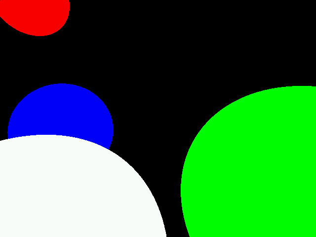

# DBS-RayTracing
RayTracing project using DarkBASIC Software. Largely inspired by Sebastian Lague "RayTracing with Unity" project.

### Ray collision detection with sphere and colored material
  
Image of the 3D scene with the built-in 3D engine, 640x480 resolution

  
Ray collision detection render, calculated on a 640x480 resolution but displayed as 80x60 in 20 seconds.

  
Image of the 3D scene with the built-in 3D engine, 640x480 resolution

  
Ray collision detection render, 640x480 resolution in 14 minutes.
